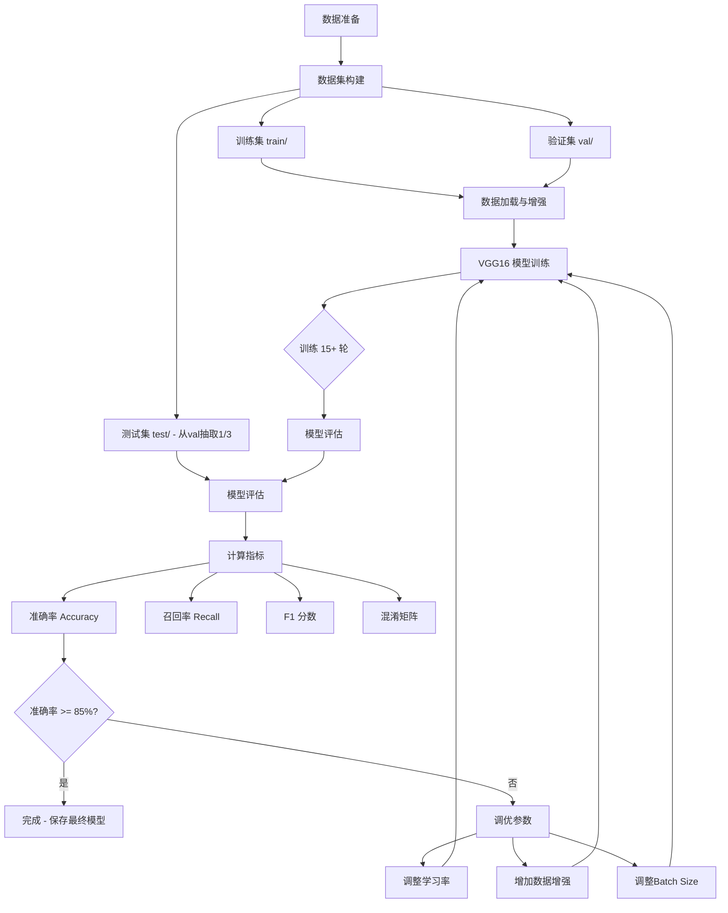

# 动物图像分类项目 - 设计文档

## 1. 系统架构



## 2. 数据集结构

```
dataset/
├── train/          # 训练集
│   ├── cat/
│   ├── dog/
│   ├── tiger/
│   └── lion/
├── val/            # 验证集
│   ├── cat/
│   ├── dog/
│   ├── tiger/
│   └── lion/
└── test/           # 测试集 (从val每类抽1/3)
    ├── cat/
    ├── dog/
    ├── tiger/
    └── lion/
```

## 3. 技术栈

- Python 3.10+
- PyTorch 2.x + torchvision
- matplotlib / seaborn (可视化)
- scikit-learn (评估指标)
- Pillow (图像处理)

## 4. 模型架构

- 基础模型: VGG16 (预训练 ImageNet 权重)
- 修改分类头: 4096 -> 256 -> 4 (4类动物)
- 损失函数: CrossEntropyLoss
- 优化器: Adam / SGD with momentum
- 学习率调度: StepLR / CosineAnnealingLR

## 5. 评估指标

| 指标 | 说明 |
|------|------|
| Accuracy | 整体准确率 |
| Precision | 每类精确率 |
| Recall | 每类召回率 |
| F1 Score | 精确率与召回率的调和平均 |
| Confusion Matrix | 混淆矩阵可视化 + 原因分析 |

## 6. 调优策略

1. 基线训练: lr=0.001, batch_size=32, epochs=15
2. 若准确率 < 85%:
   - 降低学习率至 0.0005
   - 增强数据增强 (RandomRotation, ColorJitter)
   - 增加训练轮数至 20
   - 使用 CosineAnnealingLR 调度器
3. 目标: 准确率至少提升 2%
